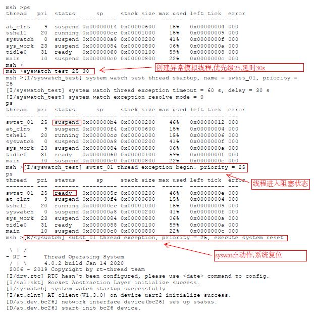
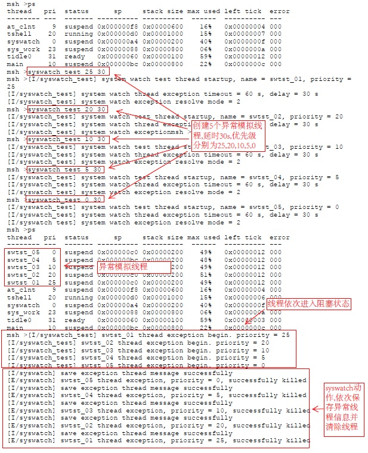
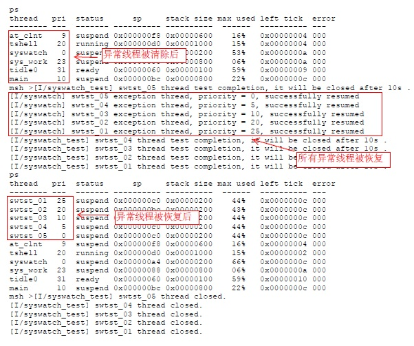

# 系统看守

## 1.简介

**系统看守(syswatch)组件** 主要功能是保障实时操作系统正常运行，防止系统死机以及各种异常引起的线程阻塞，保障整个系统长期正常运行。系统看守具备以下几种行为模式：
1.系统崩溃或硬件异常导致系统失去调度时，执行 `系统复位` 恢复系统正常运行。
2.当有异常导致某些线程长时间阻塞时，可根据用户的配置实施 `系统复位` / `杀掉阻塞线程` / `重启阻塞线程` 的方式恢复系统正常运行。

### 1.1工作原理简述 

**系统看守(syswatch)组件** 使用实时操作系统中允许的最高优先级作为看守线程的优先级，保障看守线程不会被阻塞，同时看守线程由看门狗提供看护，保障看守线程正常运行；系统看守通过 `线程调度回调接口` 监测线程的调度情况，当检测到有线程发生异常阻塞时，开始检测和确认具体哪个线程发生了异常阻塞，最后根据异常解决模式执行  `系统复位` / `杀掉阻塞线程` / `重启阻塞线程` 清除异常，使系统恢复正常运行。

### 1.2文件组成

|文件|说明|
|----|----|
|syswatch_config.h|组件参数配置头文件，配置组件的使能、工作模式等工作参数|
|syswatch.h|组件API接口头文件，定义了供用户使用的接口函数，以及参数定义等|
|syswatch.c|组件的主功能模块，实现系统运行监测，线程异常识别，异常解决等功能|
|syswatch_test.c|组件的测试功能模块，模拟异常线程，用于测试和验证组件功能|

### 1.3许可证

syswatch package 遵循 LGPLv2.1 许可。

### 1.4依赖

- RT_Thread 4.0
- RT_Thread watchdog device
- RT_Thread enable system hook

## 2.使用

### 2.1获取组件

- **方式1：**
1.下载syswatch软件包，并将软件包`syswatch`文件夹复制到工程原码目录下
2.将软件包中syswatch.c和syswatch_test.c加入项目工程中
3.将软件包中syswatch_config.h中 `RT_USING_SYSWATCH` 和 `RT_USING_SYSWATCH_TEST` 两个宏的注释去掉;并根据需要修改各项配置参数

- **方式2：**
通过 *Env配置工具* 或 *RT-Thread studio* 开启syswatch组件软件包，根据需要配置各项参数。

### 2.2配置参数说明

|参数宏|说明|
|----|----|
|`SYSWATCH_EXCEPT_RESOLVE_MODE`|异常解决模式，可配置值0~2，默认值 2，0--复位系统，1--杀掉异常线程，2--重启异常线程
|`SYSWATCH_EXCEPT_TIMEOUT`|判定存在线程异常的超时时间，单位：秒，默认值 60
|`SYSWATCH_EXCEPT_CONFIRM_TMO`|确认异常线程的超时时间，单位：秒，默认值 15
|`SYSWATCH_EXCEPT_RESUME_DLY`|重启异常线程的延时时间，单位：秒，默认值 15
|`SYSWATCH_THREAD_PRIO`|系统看守线程的优先级，默认值 0
|`SYSWATCH_THREAD_STK_SIZE`|系统看守线程的堆栈尺寸，默认值 512
|`SYSWATCH_THREAD_NAME`|系统看守线程的名称，默认值 `syswatch`
|`SYSWATCH_WDT_NAME`|使用看门狗设备的名称，默认值 `wdt`
|`SYSWATCH_WDT_TIMEOUT`|使用看门设备的超时时间，单位：秒，默认值 5

## 3.注意事项

- syswatch 依赖于看门狗设备而工作，使用本组件时请确认已注册了看门狗设备。
- syswatch 全权管理看门狗，请不要在其它线程中使用和操作看门狗。
- syswatch 提供了3种异常解决模式，请根据实际需要配置适合的工作模式。
- `syswatch_set_event_hook` 接口函数是提供给用户针对重要事件发生时进行一些必要处理而提供的，如系统复位前须对重要数据进行保存时，可设置回调函数完成相应处理，如不需要可不设置。

## 4.测试验证

组件安装后，为了验证其功能是否正常，组件提供了测试例程，可通过shell命令`syswatch_test`创建异常模拟线程。
`syswatch_test`命令参数有2个，第1个是创建线程的优先级，第2个是发生异常阻塞的延时时间。
如执行命令`syswatch_test 20 30`后，会创建一个优先级为20的线程，在线程开始运行30秒后，线程进入异常阻塞状态。

### 4.1模式0测试示例

### 4.2模式1测试示例

### 4.3模式2测试示例

